# CFGPNet: Cross-Attention-Based Fused Gradient Programmed Network Framework for Multispectral Object Detection

## 📖 Introduction
This repository contains the official implementation of **CFGPNet**, a framework designed to improve multispectral object detection through **Extensively improved GELAN**, **Computation efficient attention**, **Attention selection and Aggregation fusion**, and **Programmable gradient information**.  
This approach strengthens feature representation while preserving computational efficiency, enhances cross-modal feature interaction and reduces redundant information transfer between visible and thermal branches, combines dense feature aggregation with selective attention-based emphasis, and also improves gradient delivery and optimization quality without altering the inference pathway. 

### CFGPNet-c, -m:

<p align="center">
  <a href="docs/dualyolo2-c.png">
    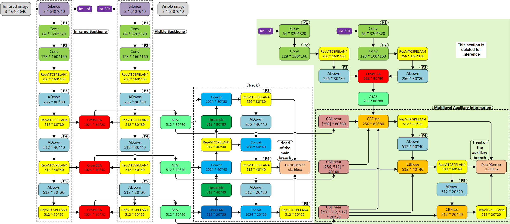
  </a>
</p>

### CFGPNet-e:

<p align="center">
  <a href="docs/dualyolo2-e.png">
    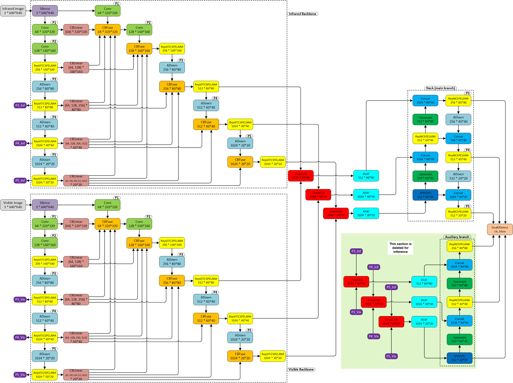
  </a>
</p>

### RepViTCSPELAN4: 

<p align="center">
  <a href="docs/RepViTCSPELAN4.png">
    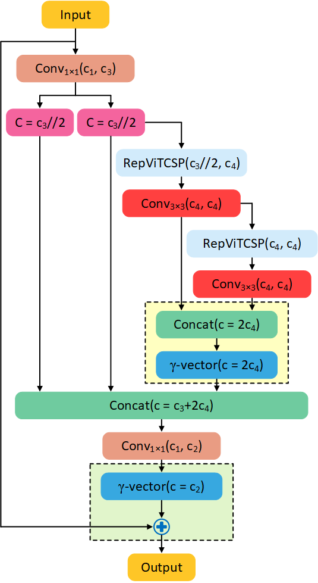
  </a>
</p> 

### MFE: 

<p align="center">
  <a href="docs/shuffle.png">
    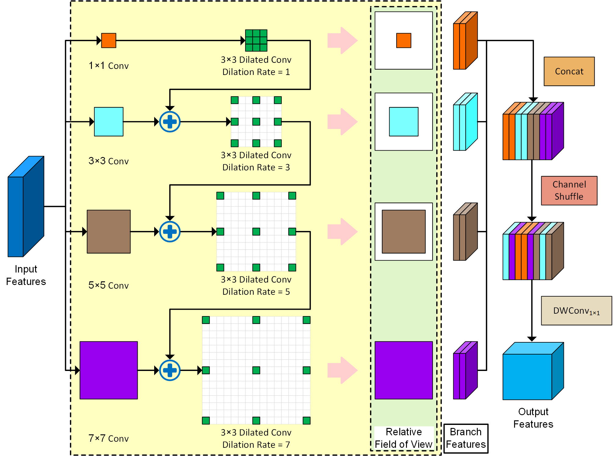
  </a>
</p> 

### CEA: 

<p align="center">
  <a href="docs/EEMA.png">
    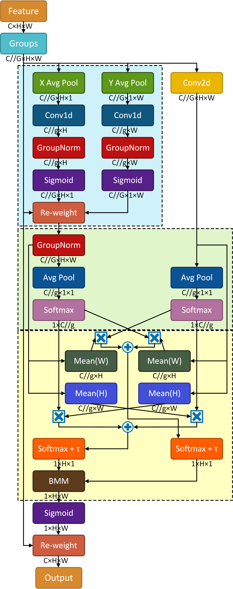
  </a>
</p> 

### ASAF: 

<p align="center">
  <a href="docs/FeatFuse.png">
    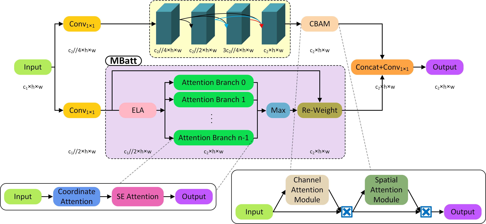
  </a>
</p> 

--- 

## 📈 Performance

### Quantitative comparison on the **FLIR** dataset

| **Modality** | **Model** | **mAP50** | **mAP50:95** | **Weights (M)** |
|:--:|:--:|:--:|:--:|:--:|
| **T** | [Fast R-CNN (2015)](https://openaccess.thecvf.com/content_iccv_2015/html/Girshick_Fast_R-CNN_ICCV_2015_paper.html) | 74.2 | 38.0 | -- |
| **T** | [SSD (2016)](https://doi.org/10.1007/978-3-319-46448-0_2) | 65.1 | 30.2 | -- |
| **T** | [RetinaNet (2017)](https://ieeexplore.ieee.org/document/8417976) | 64.9 | 28.6 | -- |
| **T** | [YOLOv5 (2022)](https://zenodo.org/records/7002879) | 74.2 | 37.2 | -- |
| **T** | [YOLOv8 (2023)](https://github.com/ultralytics/ultralytics) | 74.2 | 37.7 | -- |
| **T** | [YOLOv11 (2024)](https://arxiv.org/abs/2410.17725) | 75.3 | 38.9 | -- |
| **T** | [YOLOX (2021)](https://arxiv.org/abs/2107.08430) | 79.5 | 41.6 | -- |
| **T** | [DINO (2022)](https://arxiv.org/abs/2203.03605) | 78.7 | 40.3 | -- |
| **T** | [MobileFormer (2022)](https://openaccess.thecvf.com/content/CVPR2022/html/Chen_Mobile-Former_Bridging_MobileNet_and_Transformer_CVPR_2022_paper.html) | 72.9 | 36.0 | -- |
| **T** | [EfficientViT (2023)](https://openaccess.thecvf.com/content/CVPR2023/html/Liu_EfficientViT_Memory_Efficient_Vision_Transformer_With_Cascaded_Group_Attention_CVPR_2023_paper.html) | 73.1 | 36.6 | -- |
| **RGB** | [Fast R-CNN (2015)](https://openaccess.thecvf.com/content_iccv_2015/html/Girshick_Fast_R-CNN_ICCV_2015_paper.html) | 67.6 | 30.1 | -- |
| **RGB** | [SSD (2016)](https://doi.org/10.1007/978-3-319-46448-0_2) | 59.3 | 23.2 | -- |
| **RGB** | [RetinaNet (2017)](https://ieeexplore.ieee.org/document/8417976) | 59.1 | 23.0 | -- |
| **RGB** | [YOLOv5 (2022)](https://zenodo.org/records/7002879) | 68.4 | 31.3 | -- |
| **RGB** | [YOLOv8 (2023)](https://github.com/ultralytics/ultralytics) | 68.2 | 31.2 | -- |
| **RGB** | [YOLOv11 (2024)](https://arxiv.org/abs/2410.17725) | 68.9 | 31.9 | -- |
| **RGB** | [YOLOX (2021)](https://arxiv.org/abs/2107.08430) | 72.5 | 35.1 | -- |
| **RGB** | [DINO (2022)](https://arxiv.org/abs/2203.03605) | 65.3 | 30.5 | -- |
| **RGB** | [SuperYOLO (2023)](https://doi.org/10.1109/TGRS.2023.3258666) | 72.5 | -- | -- |
| **RGB** | [MobileFormer (2022)](https://openaccess.thecvf.com/content/CVPR2022/html/Chen_Mobile-Former_Bridging_MobileNet_and_Transformer_CVPR_2022_paper.html) | 66.9 | 30.2 | -- |
| **RGB** | [EfficientViT (2023)](https://openaccess.thecvf.com/content/CVPR2023/html/Liu_EfficientViT_Memory_Efficient_Vision_Transformer_With_Cascaded_Group_Attention_CVPR_2023_paper.html) | 67.3 | 30.7 | -- |
| **RGB-T** | [MMI-Det (2024)](https://doi.org/10.1109/TCSVT.2024.3418965) | 79.8 | 40.5 | 207.6 |
| **RGB-T** | [CFT (2021)](https://arxiv.org/abs/2111.00273) | 78.7 | 40.2 | 196.9 |
| **RGB-T** | [ICAFusion (2024)](https://www.sciencedirect.com/science/article/pii/S0031320323006118) | 79.2 | 41.4 | 120.2 |
| **RGB-T** | [CSSA (2023)](https://openaccess.thecvf.com/content/CVPR2023W/PBVS/html/Cao_Multimodal_Object_Detection_by_Channel_Switching_and_Spatial_Attention_CVPRW_2023_paper.html) | 79.2 | 41.3 | -- |
| **RGB-T** | [LRAF-Net (2023)](https://doi.org/10.1109/TNNLS.2023.3266452) | <ins>80.5</ins> | 42.8 | -- |
| **RGB-T** | [C<sup>2</sup>DFF-Net (2025)](https://doi.org/10.1109/TGRS.2025.3614295) | 76.9 | 40.8 | 6.6 |
| **RGB-T** | [YOLO-Adaptor (2024)](https://doi.org/10.1109/TIV.2024.3393015) | 80.1 | -- | -- |
| **RGB-T** | [CrossFormer (2024)](https://www.sciencedirect.com/science/article/pii/S016786552400045X) | 79.3 | 42.1 | -- |
| **RGB-T** | [EI<sup>2</sup>Det (2025)](https://doi.org/10.1109/TCSVT.2025.3539625) | 80.2 | -- | 127.7 |
| **RGB-T** | [CAMDet (2025)](https://doi.org/10.1109/ICASSP49660.2025.10889505) | 76.3 | 37.1 | -- |
| **RGB-T** | [DHANet (2025)](https://doi.org/10.1109/TGRS.2025.3578675) | 74.3 | -- | -- |
| **RGB-T** | [MRD-YOLO (2024)](https://www.mdpi.com/1424-8220/24/10/3222) | 76.5 | 40.9 | -- |
| **RGB-T** | [DFF (2025)](https://www.mdpi.com/2076-3417/15/11/5857) | 80.1 | 38.5 | 120.9 |
| **RGB-T** | [LCMA (2026)](https://www.mdpi.com/2079-9292/15/3/498) | <ins>80.5</ins> | 42.2 | -- |
| **RGB-T** | [M2I2HA (2026)](https://arxiv.org/abs/2601.14776) | 72.5 | 37.8 | 37.6 |
| **RGB-T** | [JFDet (2026)](https://www.mdpi.com/2072-4292/18/1/176) | 76.3 | -- | -- |
| **RGB-T** | [MCOR (2025)](https://openaccess.thecvf.com/content/WACV2025/html/Jang_Multispectral_Object_Detection_Enhanced_by_Cross-Modal_Information_Complementary_and_Cosine_WACV_2025_paper.html) | 78.2 | 39.9 | -- |
| **RGB-T** | [ERFF (2026)](https://www.sciencedirect.com/science/article/pii/S1566253525011728) | <ins>80.6</ins> | -- | -- |
| **RGB-T** | [ADCA-Net (2026)](https://www.sciencedirect.com/science/article/pii/S0957417426009255) | 78.9 | -- | 34.0 |
| **RGB-T** | [DLRMamba (2026)](https://arxiv.org/abs/2603.06920) | 80.0 | -- | -- |
| **RGB-T** | [FCAT (2026)](https://www.mdpi.com/2072-4292/18/5/826) | 79.9 | 42.7 | 85.2 |
| **RGB-T** | [PMDet (2026)](https://www.mdpi.com/2072-4292/18/7/1068) | 80.4 | 42.8 | 277.1 |
| **RGB-T** | CFGPNet-m | 80.0 | <ins>43.1</ins> | 21.0 |
| **RGB-T** | CFGPNet-c | 79.8 | <ins>43.6</ins> | 71.7 |
| **RGB-T** | CFGPNet-e | <ins>80.7</ins> | <ins>45.0</ins> | 180.9 |

> **Notes:** The three best results are underlined.

<p align="center">
  <a href="docs/FLIR_map_param_diagram.png">
    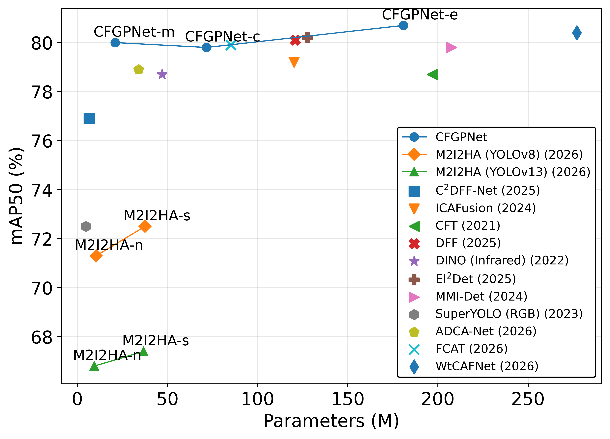
  </a>
</p>

### Quantitative comparison on the **M3FD** dataset

| **Modality** | **Model** | **mAP50** | **mAP50:95** | **Weights (M)** |
|:--:|:--:|:--:|:--:|:--:|
| **T** | [Fast R-CNN (2015)](https://openaccess.thecvf.com/content_iccv_2015/html/Girshick_Fast_R-CNN_ICCV_2015_paper.html) | 78.5 | 49.0 | -- |
| **T** | [SSD (2016)](https://doi.org/10.1007/978-3-319-46448-0_2) | 76.9 | 46.6 | -- |
| **T** | [RetinaNet (2017)](https://ieeexplore.ieee.org/document/8417976) | 79.3 | 49.3 | -- |
| **T** | [YOLOv5 (2022)](https://zenodo.org/records/7002879) | 80.5 | 50.6 | -- |
| **T** | [YOLOv8 (2023)](https://github.com/ultralytics/ultralytics) | 81.3 | 51.0 | -- |
| **T** | [YOLOv11 (2024)](https://arxiv.org/abs/2410.17725) | 81.2 | 50.8 | -- |
| **T** | [YOLOX (2021)](https://arxiv.org/abs/2107.08430) | 80.6 | 50.3 | -- |
| **T** | [MobileFormer (2022)](https://openaccess.thecvf.com/content/CVPR2022/html/Chen_Mobile-Former_Bridging_MobileNet_and_Transformer_CVPR_2022_paper.html) | 79.3 | 49.5 | -- |
| **T** | [EfficientViT (2023)](https://openaccess.thecvf.com/content/CVPR2023/html/Liu_EfficientViT_Memory_Efficient_Vision_Transformer_With_Cascaded_Group_Attention_CVPR_2023_paper.html) | 80.7 | 50.3 | -- |
| **RGB** | [Fast R-CNN (2015)](https://openaccess.thecvf.com/content_iccv_2015/html/Girshick_Fast_R-CNN_ICCV_2015_paper.html) | 80.8 | 51.1 | -- |
| **RGB** | [SSD (2016)](https://doi.org/10.1007/978-3-319-46448-0_2) | 79.4 | 48.6 | -- |
| **RGB** | [RetinaNet (2017)](https://ieeexplore.ieee.org/document/8417976) | 81.9 | 51.4 | -- |
| **RGB** | [YOLOv5 (2022)](https://zenodo.org/records/7002879) | 83.2 | 52.3 | -- |
| **RGB** | [YOLOv8 (2023)](https://github.com/ultralytics/ultralytics) | 84.3 | 53.4 | -- |
| **RGB** | [YOLOv11 (2024)](https://arxiv.org/abs/2410.17725) | 83.7 | 54.3 | -- |
| **RGB** | [YOLOX (2021)](https://arxiv.org/abs/2107.08430) | 82.2 | 50.8 | -- |
| **RGB** | [MobileFormer (2022)](https://openaccess.thecvf.com/content/CVPR2022/html/Chen_Mobile-Former_Bridging_MobileNet_and_Transformer_CVPR_2022_paper.html) | 82.1 | 51.3 | -- |
| **RGB** | [EfficientViT (2023)](https://openaccess.thecvf.com/content/CVPR2023/html/Liu_EfficientViT_Memory_Efficient_Vision_Transformer_With_Cascaded_Group_Attention_CVPR_2023_paper.html) | 84.0 | 52.7 | -- |
| **RGB-T** | [MMI-Det (2024)](https://doi.org/10.1109/TCSVT.2024.3418965) | 83.5 | 51.9 | 207.6 |
| **RGB-T** | [CFT (2021)](https://arxiv.org/abs/2111.00273) | 85.0 | 54.5 | 196.9 |
| **RGB-T** | [ICAFusion (2024)](https://www.sciencedirect.com/science/article/pii/S0031320323006118) | 85.1 | 53.5 | 120.2 |
| **RGB-T** | [TF-YOLO (2023)](https://www.mdpi.com/2032-6653/14/12/352) | 87.9 | -- | -- |
| **RGB-T** | [EI<sup>2</sup>Det (2025)](https://doi.org/10.1109/TCSVT.2025.3539625) | 86.2 | 55.5 | 127.7 |
| **RGB-T** | [MRD-YOLO (2024)](https://www.mdpi.com/1424-8220/24/10/3222) | 86.6 | 59.3 | -- |
| **RGB-T** | [DFF (2025)](https://www.mdpi.com/2076-3417/15/11/5857) | 84.2 | 52.4 | 120.9 |
| **RGB-T** | [MCOR (2025)](https://openaccess.thecvf.com/content/WACV2025/html/Jang_Multispectral_Object_Detection_Enhanced_by_Cross-Modal_Information_Complementary_and_Cosine_WACV_2025_paper.html) | 87.2 | 57.3 | -- |
| **RGB-T** | [TINet (2023)](https://doi.org/10.1109/TIM.2023.3251414) | 85.0 | 49.5 | -- |
| **RGB-T** | [TarDAL (2022)](https://openaccess.thecvf.com/content/CVPR2022/html/Liu_Target-Aware_Dual_Adversarial_Learning_and_a_Multi-Scenario_Multi-Modality_Benchmark_To_CVPR_2022_paper.html) | 80.7 | 50.1 | -- |
| **RGB-T** | [MMFN (2025)](https://doi.org/10.1109/TCSVT.2024.3454631) | 86.2 | -- | 176.4 |
| **RGB-T** | [CrossModalNet (2026)](https://www.sciencedirect.com/science/article/pii/S0957417425032920) | 87.3 | 55.6 | 92.8 |
| **RGB-T** | [LEFuse (2025)](https://www.sciencedirect.com/science/article/pii/S0925231225002644) | 78.9 | 48.5 | -- |
| **RGB-T** | [IVHL (2025)](https://doi.org/10.1109/TMM.2025.3639945) | 83.4 | 55.8 | 271.0 |
| **RGB-T** | [FD2Net (2025)](https://ojs.aaai.org/index.php/AAAI/article/view/32507) | 83.5 | -- | -- |
| **RGB-T** | [CARNet (2026)](https://www.sciencedirect.com/science/article/pii/S0957417425034803) | 84.3 | -- | 271.7 |
| **RGB-T** | [DMFusion-YOLOv8 (2025)](https://doi.org/10.1007/s11760-025-05014-6) | 84.2 | 55.4 | 13.2 |
| **RGB-T** | [FreDFT (2025)](https://arxiv.org/abs/2511.10046) | 88.4 | 59.7 | -- |
| **RGB-T** | [MAFTNet (2026)](https://doi.org/10.1109/JSEN.2025.3649961) | 75.6 | 51.1 | 30.5 |
| **RGB-T** | [MCFFSQR (2025)](https://www.sciencedirect.com/science/article/pii/S1350449525005250) | 80.8 | 53.6 | 77.0 |
| **RGB-T** | [EFAF (2025)](https://doi.org/10.1109/JSTARS.2025.3648007) | 88.8 | 58.0 | 395.0 |
| **RGB-T** | [SCIA (2025)](https://www.sciencedirect.com/science/article/pii/S0893608025014145) | 88.6 | 59.9 | -- |
| **RGB-T** | [PFI-Net (2025)](https://www.sciencedirect.com/science/article/pii/S0031320325016668) | 82.9 | 53.2 | 14.9 |
| **RGB-T** | [RSC-MD (2025)](https://arxiv.org/abs/2511.15433) | 85.2 | 59.5 | -- |
| **RGB-T** | [SCVI (2026)](https://www.sciencedirect.com/science/article/pii/S0925231226000858) | 68.8 | 40.1 | -- |
| **RGB-T** | [WtCAFNet (2025)](https://www.sciencedirect.com/science/article/pii/S0165168425005626) | 85.2 | 58.2 | 59.9 |
| **RGB-T** | [DLRMamba (2026)](https://arxiv.org/abs/2603.06920) | 76.6 | -- | -- |
| **RGB-T** | [DWSF-Net (2026)](https://doi.org/10.1109/TMM.2026.3668686) | 86.9 | -- | 289.7 |
| **RGB-T** | [SAFF (2026)](https://doi.org/10.1109/TGRS.2026.3674467) | 87.4 | 60.1 | -- |
| **RGB-T** | [DDIF (2026)](https://doi.org/10.1109/TIP.2026.3671618) | 80.8 | 52.1 | 62.8 |
| **RGB-T** | [CHEF-Det (2026)](https://www.sciencedirect.com/science/article/pii/S1051200426002137) | 82.4 | 54.8 | -- |
| **RGB-T** | [IVFDNet (2026)](https://www.sciencedirect.com/science/article/pii/S0925231226010374) | <ins>88.9</ins> | -- | -- |
| **RGB-T** | [ACSE-Net (2026)](https://link.springer.com/article/10.1007/s44443-026-00732-4) | 86.3 | 59.4 | 55.0 |
| **RGB-T** | [SFCNet (2026)](https://www.researchgate.net/publication/404236009_Modality-Aware_Fusion_and_Selection_for_Robust_Multispectral_Pedestrian_Detection) | 80.4 | 53.5 | -- |
| **RGB-T** | [MDAFN (2026)](https://doi.org/10.1109/TVT.2026.3678921) | 87.0 | 54.6 | -- |
| **RGB-T** | [OARE (2026)](https://doi.org/10.1109/TMM.2026.3678036) | 88.4 | -- | -- |
| **RGB-T** | [DF-Net (2026)](https://ieeexplore.ieee.org/document/11514987) | 80.0 | 52.6 | -- |
| **RGB-T** | [WD-FQDet (2026)](https://arxiv.org/abs/2605.13621) | 73.7 | 46.4 | 60.7 |
| **RGB-T** | CFGPNet-m | 87.8 | <ins>60.3</ins> | 21.0 |
| **RGB-T** | CFGPNet-c | <ins>89.0</ins> | <ins>62.2</ins> | 71.7 |
| **RGB-T** | CFGPNet-e | <ins>89.9</ins> | <ins>63.4</ins> | 180.9 | 

> **Notes:** The three best results are underlined.

<p align="center">
  <a href="docs/M3FD_map_param_diagram.png">
    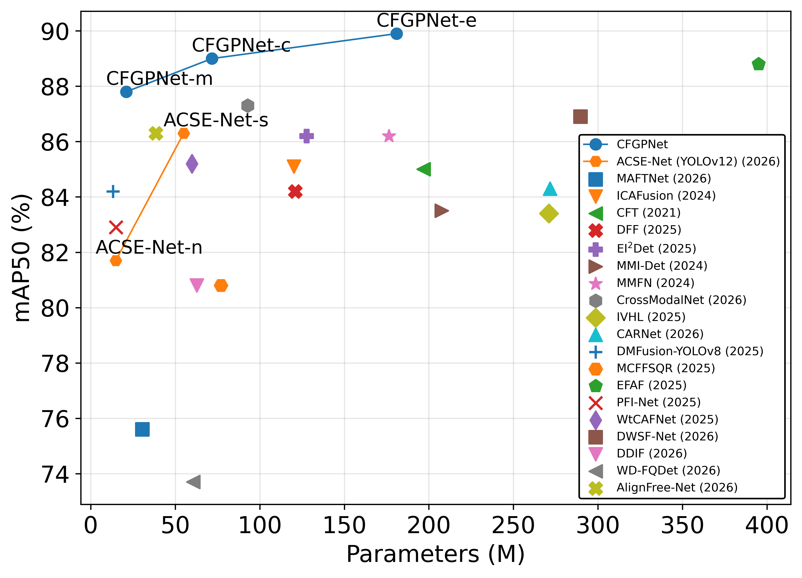
  </a>
</p>

### Quantitative comparison on the **LLVIP** dataset

| **Modality** | **Model** | **mAP50** | **mAP50:95** | **Weights (M)** |
|:--:|:--:|:--:|:--:|:--:|
| **T** | [Fast R-CNN (2015)](https://openaccess.thecvf.com/content_iccv_2015/html/Girshick_Fast_R-CNN_ICCV_2015_paper.html) | 95.4 | 61.5 | -- |
| **T** | [SSD (2016)](https://doi.org/10.1007/978-3-319-46448-0_2) | 90.7 | 53.8 | -- |
| **T** | [RetinaNet (2017)](https://ieeexplore.ieee.org/document/8417976) | 93.2 | 51.3 | -- |
| **T** | [YOLOv5 (2022)](https://zenodo.org/records/7002879) | 94.3 | 61.4 | -- |
| **T** | [YOLOv8 (2023)](https://github.com/ultralytics/ultralytics) | 95.4 | 59.2 | -- |
| **T** | [YOLOv11 (2024)](https://arxiv.org/abs/2410.17725) | 95.1 | 60.9 | -- |
| **T** | [YOLOX (2021)](https://arxiv.org/abs/2107.08430) | 95.3 | 61.1 | -- |
| **T** | [MobileFormer (2022)](https://openaccess.thecvf.com/content/CVPR2022/html/Chen_Mobile-Former_Bridging_MobileNet_and_Transformer_CVPR_2022_paper.html) | 93.2 | 59.7 | -- |
| **T** | [EfficientViT (2023)](https://openaccess.thecvf.com/content/CVPR2023/html/Liu_EfficientViT_Memory_Efficient_Vision_Transformer_With_Cascaded_Group_Attention_CVPR_2023_paper.html) | 93.8 | 60.2 | -- |
| **T** | [HalluciDet (2024)](https://openaccess.thecvf.com/content/WACV2024/html/Medeiros_HalluciDet_Hallucinating_RGB_Modality_for_Person_Detection_Through_Privileged_Information_WACV_2024_paper.html) | 90.1 | 57.8 | -- |
| **T** | [TIRDet (2023)](https://doi.org/10.1145/3581783.3613849) | 96.3 | 64.2 | -- |
| **T** | [LFTDet-B (2024)](https://doi.org/10.1109/JSEN.2024.3399193) | 96.2 | 63.8 | -- |
| **RGB** | [Fast R-CNN (2015)](https://openaccess.thecvf.com/content_iccv_2015/html/Girshick_Fast_R-CNN_ICCV_2015_paper.html) | 90.1 | 52.2 | -- |
| **RGB** | [SSD (2016)](https://doi.org/10.1007/978-3-319-46448-0_2) | 84.9 | 45.9 | -- |
| **RGB** | [RetinaNet (2017)](https://ieeexplore.ieee.org/document/8417976) | 86.3 | 42.3 | -- |
| **RGB** | [YOLOv5 (2022)](https://zenodo.org/records/7002879) | 90.8 | 52.8 | -- |
| **RGB** | [YOLOv8 (2023)](https://github.com/ultralytics/ultralytics) | 90.1 | 51.9 | -- |
| **RGB** | [YOLOv11 (2024)](https://arxiv.org/abs/2410.17725) | 90.2 | 52.6 | -- |
| **RGB** | [YOLOX (2021)](https://arxiv.org/abs/2107.08430) | 91.1 | 53.9 | -- |
| **RGB** | [MobileFormer (2022)](https://openaccess.thecvf.com/content/CVPR2022/html/Chen_Mobile-Former_Bridging_MobileNet_and_Transformer_CVPR_2022_paper.html) | 88.6 | 50.3 | -- |
| **RGB** | [EfficientViT (2023)](https://openaccess.thecvf.com/content/CVPR2023/html/Liu_EfficientViT_Memory_Efficient_Vision_Transformer_With_Cascaded_Group_Attention_CVPR_2023_paper.html) | 89.5 | 51.4 | -- |
| **RGB** | [IEGOD (2023)](https://doi.org/10.1109/TNNLS.2023.3274926) | 87.6 | -- | -- |
| **RGB-T** | [CFT (2021)](https://arxiv.org/abs/2111.00273) | 97.5 | 63.6 | 196.9 |
| **RGB-T** | [CAMDet (2025)](https://doi.org/10.1109/ICASSP49660.2025.10889505) | 96.5 | 62.7 | -- |
| **RGB-T** | [MMFN (2025)](https://doi.org/10.1109/TCSVT.2024.3454631) | 97.2 | -- | 176.4 |
| **RGB-T** | [CAMF (2023)](https://doi.org/10.1109/TMM.2023.3326296) | 89.0 | 55.6 | -- |
| **RGB-T** | [MetaFusion (2023)](https://openaccess.thecvf.com/content/CVPR2023/html/Zhao_MetaFusion_Infrared_and_Visible_Image_Fusion_via_Meta-Feature_Embedding_From_CVPR_2023_paper.html) | 91.0 | 56.9 | -- |
| **RGB-T** | [DDFM (2023)](https://openaccess.thecvf.com/content/ICCV2023/html/Zhao_DDFM_Denoising_Diffusion_Model_for_Multi-Modality_Image_Fusion_ICCV_2023_paper.html) | 91.5 | 58.0 | -- |
| **RGB-T** | [Fusion-Mamba (2025)](https://arxiv.org/abs/2404.09146) | 97.0 | 64.3 | 287.6 |
| **RGB-T** | [ICAFusion (2024)](https://www.sciencedirect.com/science/article/pii/S0031320323006118) | 96.3 | 62.3 | 120.2 |
| **RGB-T** | [CDFIT (2026)](https://doi.org/10.1109/TITS.2025.3649738) | <ins>97.6</ins> | 63.4 | 121.4 |
| **RGB-T** | [FQDNet (2025)](https://www.mdpi.com/2072-4292/17/6/1095) | 96.4 | 64.1 | -- |
| **RGB-T** | [CCAM (2025)](https://www.mdpi.com/1424-8220/25/13/3854) | 97.1 | 65.8 | 21.2 |
| **RGB-T** | [IVHL (2025)](https://doi.org/10.1109/TMM.2025.3639945) | 95.8 | 62.6 | 271.0 |
| **RGB-T** | [DF-Net (2026)](https://ieeexplore.ieee.org/document/11514987) | 97.1 | 64.1 | -- |
| **RGB-T** | [CTU-YOLO (2026)](https://www.mdpi.com/2079-9292/15/2/298) | 96.9 | -- | -- |
| **RGB-T** | [LDD-YOLO (2026)](https://doi.org/10.1007/s11760-025-04965-0) | 97.5 | 66.0 | -- |
| **RGB-T** | [AMFD (2025)](https://doi.org/10.1109/TMM.2025.3604937) | 95.2 | 58.3 | -- |
| **RGB-T** | [COMO (2026)](https://www.sciencedirect.com/science/article/pii/S1566253525004877) | 97.2 | 65.3 | 16.3 |
| **RGB-T** | [CMEE-Det (2026)](https://www.nature.com/articles/s41598-025-30786-9) | 97.0 | 64.7 | 115.5 |
| **RGB-T** | [CrossModalNet (2026)](https://www.sciencedirect.com/science/article/pii/S0957417425032920) | <ins>97.7</ins> | 64.7 | 92.8 |
| **RGB-T** | [LCMA (2026)](https://www.mdpi.com/2079-9292/15/3/498) | -- | 64.0 | -- |
| **RGB-T** | [ETPGNet (2026)](https://doi.org/10.2139/ssrn.5312893) | 97.3 | <ins>68.1</ins> | -- |
| **RGB-T** | [KDET-HPFL (2025)](https://doi.org/10.1109/JIOT.2025.3641118) | -- | 65.0 | -- |
| **RGB-T** | [LMDENet (2026)](https://www.mdpi.com/1424-8220/26/4/1130) | 93.6 | 59.2 | -- |
| **RGB-T** | [M2I2HA (2026)](https://arxiv.org/abs/2601.14776) | 95.9 | 58.8 | 37.6 |
| **RGB-T** | [MCFF-Det (2025)](https://ieeexplore.ieee.org/abstract/document/11204221) | 96.0 | 64.0 | -- |
| **RGB-T** | [EFAF (2025)](https://doi.org/10.1109/JSTARS.2025.3648007) | <ins>97.7</ins> | 63.4 | 395.0 |
| **RGB-T** | [SIA (2025)](https://www.sciencedirect.com/science/article/pii/S0893608025014145) | 97.5 | 67.3 | -- |
| **RGB-T** | [SCVI (2026)](https://www.sciencedirect.com/science/article/pii/S0925231226000858) | 97.2 | 63.1 | -- |
| **RGB-T** | [VIF-YOLO (2025)](https://ieeexplore.ieee.org/abstract/document/11322970) | 96.3 | 64.5 | -- |
| **RGB-T** | [WtCAFNet (2025)](https://www.sciencedirect.com/science/article/pii/S0165168425005626) | 96.6 | 68.0 | -- |
| **RGB-T** | [ADCA-Net (2026)](https://www.sciencedirect.com/science/article/pii/S0957417426009255) | <ins>97.6</ins> | -- | 34.0 |
| **RGB-T** | [CDFNet (2026)](https://www.sciencedirect.com/science/article/pii/S0957417426012935) | 97.5 | 65.4 | 84.8 |
| **RGB-T** | [DEF-Net (2026)](https://journals.plos.org/plosone/article?id=10.1371/journal.pone.0345815) | 95.7 | 61.7 | 12.3 |
| **RGB-T** | [DDIF (2026)](https://doi.org/10.1109/TIP.2026.3671618) | 81.2 | 44.3 | 62.8 |
| **RGB-T** | [DLRMamba (2026)](https://arxiv.org/abs/2603.06920) | 97.5 | -- | -- |
| **RGB-T** | [DWSF-Net (2026)](https://doi.org/10.1109/TMM.2026.3668686) | 97.4 | -- | 289.7 |
| **RGB-T** | [HyperDet (2026)](https://link.springer.com/article/10.1007/s44443-026-00595-9) | 97.3 | 67.3 | -- |
| **RGB-T** | [IAF-RTDETR (2026)](https://www.mdpi.com/2079-9292/15/6/1332) | 94.1 | -- | 37.0 |
| **RGB-T** | [IVD-NET (2026)](https://doi.org/10.1109/JSTARS.2026.3669585) | 96.7 | 61.9 | 27.9 |
| **RGB-T** | [LCAFNet (2026)](https://www.sciencedirect.com/science/article/pii/S0031320326003158) | <ins>97.7</ins> | 65.0 | 15.4 |
| **RGB-T** | [PMDet (2026)](https://www.mdpi.com/2072-4292/18/7/1068) | <ins>97.7</ins> | 66.6 | 277.1 |
| **RGB-T** | [MDSF-Det (2026)](https://ieeexplore.ieee.org/abstract/document/11462879) | 94.9 | 62.9 | 151.6 |
| **RGB-T** | [OARE (2026)](https://doi.org/10.1109/TMM.2026.3678036) | 95.9 | -- | -- |
| **RGB-T** | [YOLO-MSFF (2026)](https://ieeexplore.ieee.org/abstract/document/11519149) | 97.2 | 67.1 | 59.8 |
| **RGB-T** | CFGPNet-m | <ins>97.8</ins> | 67.1 | 21.0 |
| **RGB-T** | CFGPNet-c | <ins>97.7</ins> | <ins>68.8</ins> | 71.7 |
| **RGB-T** | CFGPNet-e | 97.5 | <ins>68.9</ins> | 180.9 |

> **Notes:** The three best results are underlined.

<p align="center">
  <a href="docs/LLVIP_map_param_diagram.png">
    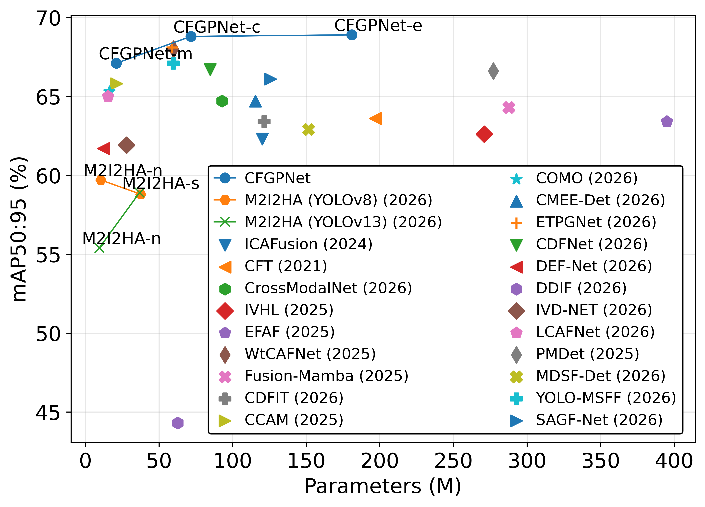
  </a>
</p>

### Quantitative comparison on the **VEDAI** dataset

| **Modality** | **Model** | **mAP50** | **mAP50:95** | **Weights (M)** |
|:--:|:--:|:--:|:--:|:--:|
| **T** | [Fast R-CNN (2015)](https://openaccess.thecvf.com/content_iccv_2015/html/Girshick_Fast_R-CNN_ICCV_2015_paper.html) | 54.2 | 38.2 | -- |
| **T** | [SSD (2016)](https://doi.org/10.1007/978-3-319-46448-0_2) | 52.9 | 36.6 | -- |
| **T** | [RetinaNet (2017)](https://ieeexplore.ieee.org/document/8417976) | 60.5 | 39.4 | -- |
| **T** | [YOLOv5 (2022)](https://zenodo.org/records/7002879) | 57.5 | 38.3 | -- |
| **T** | [YOLOv8 (2023)](https://github.com/ultralytics/ultralytics) | 61.1 | 31.1 | -- |
| **T** | [YOLOv11 (2024)](https://arxiv.org/abs/2410.17725) | 62.2 | 43.6 | -- |
| **T** | [MobileFormer (2022)](https://openaccess.thecvf.com/content/CVPR2022/html/Chen_Mobile-Former_Bridging_MobileNet_and_Transformer_CVPR_2022_paper.html) | 56.6 | 37.4 | -- |
| **T** | [EfficientViT (2023)](https://openaccess.thecvf.com/content/CVPR2023/html/Liu_EfficientViT_Memory_Efficient_Vision_Transformer_With_Cascaded_Group_Attention_CVPR_2023_paper.html) | 57.5 | 37.8 | -- |
| **RGB** | [Fast R-CNN (2015)](https://openaccess.thecvf.com/content_iccv_2015/html/Girshick_Fast_R-CNN_ICCV_2015_paper.html) | 60.8 | 41.2 | -- |
| **RGB** | [SSD (2016)](https://doi.org/10.1007/978-3-319-46448-0_2) | 57.2 | 40.3 | -- |
| **RGB** | [RetinaNet (2017)](https://ieeexplore.ieee.org/document/8417976) | 64.7 | 43.3 | -- |
| **RGB** | [YOLOv5 (2022)](https://zenodo.org/records/7002879) | 62.3 | 43.4 | -- |
| **RGB** | [YOLOv8 (2023)](https://github.com/ultralytics/ultralytics) | 67.4 | 44.2 | -- |
| **RGB** | [YOLOv11 (2024)](https://arxiv.org/abs/2410.17725) | 67.9 | 44.1 | -- |
| **RGB** | [MobileFormer (2022)](https://openaccess.thecvf.com/content/CVPR2022/html/Chen_Mobile-Former_Bridging_MobileNet_and_Transformer_CVPR_2022_paper.html) | 62.1 | 42.2 | -- |
| **RGB** | [EfficientViT (2023)](https://openaccess.thecvf.com/content/CVPR2023/html/Liu_EfficientViT_Memory_Efficient_Vision_Transformer_With_Cascaded_Group_Attention_CVPR_2023_paper.html) | 64.5 | 42.9 | -- |
| **RGB-T** | [CFT (2021)](https://arxiv.org/abs/2111.00273) | 77.2 | -- | 196.9 |
| **RGB-T** | [ICAFusion (2024)](https://www.sciencedirect.com/science/article/pii/S0031320323006118) | 76.6 | 44.9 | 120.2 |
| **RGB-T** | [CMAFF (2022)](https://www.sciencedirect.com/science/article/pii/S0031320322002679) | 78.6 | 49.1 | 12.5 |
| **RGB-T** | [MMI-Det (2024)](https://doi.org/10.1109/TCSVT.2024.3418965) | 76.6 | 42.7 | 207.6 |
| **RGB-T** | [MDA (2024)](https://ieeexplore.ieee.org/document/10770223) | 77.3 | -- | -- |
| **RGB-T** | [MCOR (2025)](https://openaccess.thecvf.com/content/WACV2025/html/Jang_Multispectral_Object_Detection_Enhanced_by_Cross-Modal_Information_Complementary_and_Cosine_WACV_2025_paper.html) | 76.2 | 46.3 | -- |
| **RGB-T** | [DF-Net (2026)](https://ieeexplore.ieee.org/document/11514987) | 66.1 | 39.6 | -- |
| **RGB-T** | [AFFNet (2026)](https://doi.org/10.1109/TIP.2026.3661868) | 75.2 | 39.7 | 120.4 |
| **RGB-T** | [C<sup>2</sup>DFF-Net (2025)](https://doi.org/10.1109/TGRS.2025.3614295) | 79.8 | 50.2 | 6.6 |
| **RGB-T** | [CARNet (2026)](https://papers.ssrn.com/sol3/papers.cfm?abstract_id=5292837) | 81.4 | 51.0 | 271.7 |
| **RGB-T** | [COMO (2026)](https://www.sciencedirect.com/science/article/pii/S1566253525004877) | <ins>81.7</ins> | 50.3 | 16.3 |
| **RGB-T** | [CrossModalNet (2026)](https://www.sciencedirect.com/science/article/pii/S0957417425032920) | 79.3 | 49.2 | 92.8 |
| **RGB-T** | [DDFD (2025)](https://doi.org/10.1145/3746027.3755183) | 78.3 | -- | -- |
| **RGB-T** | [DB-CMCNet (2026)](https://doi.org/10.1080/01431161.2026.2646583) | 75.6 | 47.7 | -- |
| **RGB-T** | [M2I2HA (2026)](https://arxiv.org/abs/2601.14776) | 73.5 | 43.6 | 37.6 |
| **RGB-T** | [MCISFNet (2025)](https://doi.org/10.1109/JSTARS.2025.3648023) | 76.7 | -- | 13.9–54.7 |
| **RGB-T** | [PMDet (2026)](https://www.mdpi.com/2072-4292/18/7/1068) | 74.7 | 45.5 | 277.1 |
| **RGB-T** | [ERFF (2026)](https://www.sciencedirect.com/science/article/pii/S1566253525011728) | 79.5 | -- | 17.2 |
| **RGB-T** | [SAFF (2026)](https://doi.org/10.1109/TGRS.2026.3674467) | 63.3 | 43.3 | -- |
| **RGB-T** | [VIF-YOLO (2025)](https://doi.org/10.1109/ICPADS67057.2025.11322970) | 75.1 | 44.9 | -- |
| **RGB-T** | [DHANet (2025)](https://doi.org/10.1109/TGRS.2025.3578675) | 78.2 | -- | -- |
| **RGB-T** | [FQDNet (2025)](https://www.mdpi.com/2072-4292/17/6/1095) | 75.9 | 47.7 | 4.7–17.6 |
| **RGB-T** | [MMYFnet (2024)](https://www.mdpi.com/2072-4292/16/23/4451) | 80.0 | 52.1 | 17.2 |
| **RGB-T** | [MOD-YOLO (2024)](https://www.sciencedirect.com/science/article/pii/S0167865524001399) | 59.3 | 36.8 | 16.0–24.9 |
| **RGB-T** | [JFDet (2026)](https://www.mdpi.com/2072-4292/18/1/176) | 79.6 | -- | -- |
| **RGB-T** | [PDBA-MRB (2026)](https://doi.org/10.21203/rs.3.rs-9380305/v1) | 75.1 | 46.3 | 43.5 |
| **RGB-T** | [YOLO-CH (2026)](https://www.mdpi.com/2504-446X/10/5/350) | 65.3 | 40.0 | 5.6 |
| **RGB-T** | [YOLO-MSFF (2026)](https://ieeexplore.ieee.org/abstract/document/11519149) | 76.0 | 44.1 | 59.8 |
| **RGB-T** | CFGPNet-m | 79.8 | <ins>52.4</ins> | 21.0 |
| **RGB-T** | CFGPNet-c | <ins>83.3</ins> | <ins>56.9</ins> | 71.7 |
| **RGB-T** | CFGPNet-e | <ins>82.9</ins> | <ins>54.2</ins> | 180.9 |

> **Notes:** The three best results are underlined.

<p align="center">
  <a href="docs/VEDAI_map_param_diagram.png">
    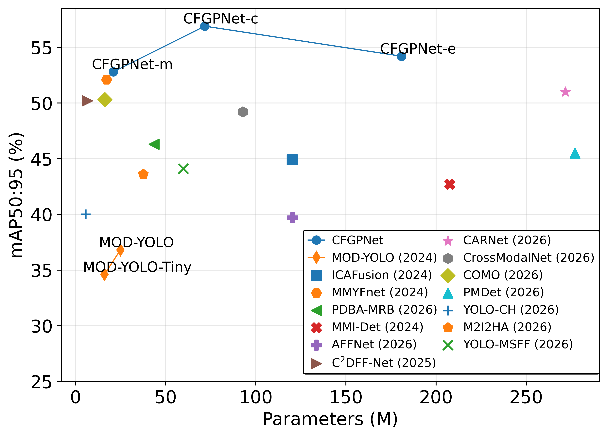
  </a>
</p>

### Quantitative comparison on the **MFAD** dataset

| **Modality** | **Model** | **mAP50** | **mAP50:95** | **Weights (M)** |
|:--:|:--:|:--:|:--:|:--:|
| **T** | [YOLOv5-l (2022)](https://zenodo.org/records/7347926) | 70.0 | 42.8 | -- |
| **T** | [YOLOv7-x (2022)](https://openaccess.thecvf.com/content/CVPR2023/html/Wang_YOLOv7_Trainable_Bag-of-Freebies_Sets_New_State-of-the-Art_for_Real-Time_Object_Detectors_CVPR_2023_paper.html) | 66.5 | 40.6 | -- |
| **T** | [YOLOv10-l (2024)](https://papers.neurips.cc/paper_files/paper/2024/hash/c34ddd05eb089991f06f3c5dc36836e0-Abstract-Conference.html) | 65.7 | 41.8 | -- |
| **T** | [YOLOX-l (2024)](https://arxiv.org/abs/2107.08430) | 63.2 | 39.2 | -- |
| **RGB** | [YOLOv5-l (2022)](https://zenodo.org/records/7347926) | 74.9 | 49.1 | -- |
| **RGB** | [YOLOv7-x (2022)](https://openaccess.thecvf.com/content/CVPR2023/html/Wang_YOLOv7_Trainable_Bag-of-Freebies_Sets_New_State-of-the-Art_for_Real-Time_Object_Detectors_CVPR_2023_paper.html) | 72.9 | 48.8 | -- |
| **RGB** | [YOLOv10-l (2024)](https://papers.neurips.cc/paper_files/paper/2024/hash/c34ddd05eb089991f06f3c5dc36836e0-Abstract-Conference.html) | 71.1 | 48.9 | -- |
| **RGB** | [YOLOX-l (2024)](https://arxiv.org/abs/2107.08430) | 68.6 | 46.8 | -- |
| **RGB-T** | [CFT (2021)](https://arxiv.org/abs/2111.00273) | 77.8 | 52.5 | 196.9 |
| **RGB-T** | [TINet (2023)](https://doi.org/10.1109/TIM.2023.3251414) | 69.1 | 43.6 | -- |
| **RGB-T** | [TarDAL (2022)](https://openaccess.thecvf.com/content/CVPR2022/html/Liu_Target-Aware_Dual_Adversarial_Learning_and_a_Multi-Scenario_Multi-Modality_Benchmark_To_CVPR_2022_paper.html) | 69.8 | 43.9 | -- |
| **RGB-T** | [MMI-Det (2024)](https://doi.org/10.1109/TCSVT.2024.3418965) | 76.9 | 51.4 | 207.6 |
| **RGB-T** | [ICAFusion (2024)](https://www.sciencedirect.com/science/article/pii/S0031320323006118) | 77.6 | 52.7 | 120.2 |
| **RGB-T** | [EI<sup>2</sup>Det (2025)](https://doi.org/10.1109/TCSVT.2025.3539625) | 79.0 | 53.3 | 127.7 |
| **RGB-T** | [LCAFNet (2026)](https://www.sciencedirect.com/science/article/pii/S0031320326003158) | <ins>79.8</ins> | 53.3 | 15.4 |
| **RGB-T** | [RSC-MD (2025)](https://arxiv.org/abs/2511.15433) | 79.4 | <ins>57.0</ins> | -- |
| **RGB-T** | CFGPNet-m | 79.6 | 56.7 | 21.0 |
| **RGB-T** | CFGPNet-c | <ins>82.0</ins> | <ins>59.9</ins> | 71.7 |
| **RGB-T** | CFGPNet-e | <ins>83.4</ins> | <ins>61.8</ins> | 180.9 |

> **Notes:** The three best results are underlined.

<p align="center">
  <a href="docs/MFAD_map_param_diagram.png">
    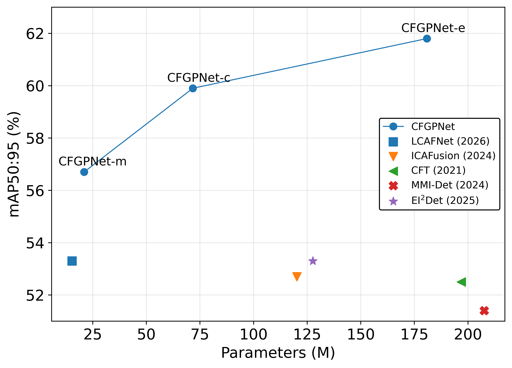
  </a>
</p>

To further illustrate performance, Figure below presents the precision-recall curves for the CFGPnet-e model across multiple datasets.

<p align="center">
  <a href="docs/PR.png">
    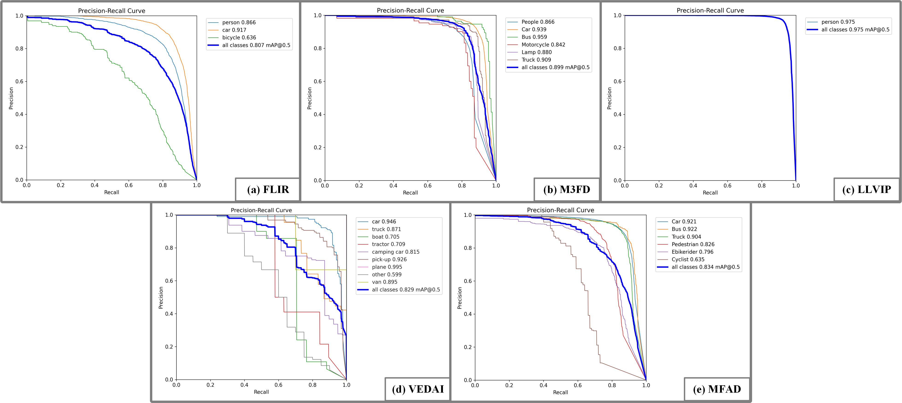
  </a>
</p>

---

## 📐 Framework Specifications

### CFGPNet model scales

**Input size:** 640×640

| **Model** | **#Param. (M)** | **GFLOPs (G)** | **FPS** | **Model Size (MB)** | **#Layers** |
|:---:|:---:|:---:|:---:|:---:|:---:|
| **CFGPNet-m** | 21.0 | 94.6 | 1463.4 | 41.6 | 1165 |
| **CFGPNet-c** | 71.7 | 362.2 | 386.1 | 138.8 | 1165 |
| **CFGPNet-e** | 180.9 | 560.7 | 136.9 | 349.6 | 1806 |

> **Notes:** #Param. and GFLOPs are reported for a single forward pass at `1×6×640×640`. FPS is measured by timing the forward pass only, excluding data loading and preprocessing.

---

## 🛠 Requirements

- **Python**: 3.10  
- **PyTorch**: 1.12
- **CUDA**: 11.8

- Other requirements can be seen in requirements.txt

---

## 📊 Datasets

Five multispectral object detection datasets are used in this project:

- **FLIR**
- **M3FD**
- **LLVIP**
- **VEDAI**
- **MFAD**

For convenience, formatted versions of all datasets have been provided. These formatted datasets are ready to be used directly with the code in this repository.

Links to the unformatted datasets are also provided. If you download the original datasets, they can be formatted and preprocessed using the scripts in the [`preprocess/`](preprocess/) folder.

---

## 📁 Dataset Format

All datasets should follow the same folder organization used in this repository.

For example, the **FLIR** dataset should be organized as follows:

```code
FLIR/
├── train/
│   ├── img/
│   │   ├── 000001.jpg
│   │   ├── 000002.jpg
│   │   └── ...
│   ├── imgr/
│   │   ├── 000001.jpg
│   │   ├── 000002.jpg
│   │   └── ...
│   └── label/
│       ├── 000001.txt
│       ├── 000002.txt
│       └── ...
├── val/
│   ├── img/
│   │   └── ...
│   ├── imgr/
│   │   └── ...
│   └── label/
│       └── ...
└── test/
    ├── img/
    │   └── ...
    ├── imgr/
    │   └── ...
    └── label/
        └── ...
```

where:

```code
train rgb images:        FLIR/train/img
train infrared images:   FLIR/train/imgr
train labels:            FLIR/train/label

validation rgb images:   FLIR/val/img
validation infrared images: FLIR/val/imgr
validation labels:       FLIR/val/label

test rgb images:         FLIR/test/img
test infrared images:    FLIR/test/imgr
test labels:             FLIR/test/label
```

Before training or testing, place all dataset yaml files under the `datasets/` directory and make sure the addresses to the real files are given correctly in the yaml files:

```code
datasets/
├── FLIR.yaml
├── M3FD.yaml
├── LLVIP.yaml
├── VEDAI_1.yaml
└── MFAD.yaml
```

---

## ✅ Formatted Datasets

The following links contain the datasets in the required format.

| **Dataset** | **Download Link** |
|:--:|:--:|
| **FLIR** | [Google Drive](https://drive.google.com/drive/folders/1Q9mC5LZuLypQq2v6SYJ_HIBvh2-d6PgA?usp=sharing) |
| **M3FD** | [Google Drive](https://drive.google.com/drive/folders/1PJOvtImeOQMhOQHdGjBSjRbZrjskjHe7?usp=sharing) |
| **LLVIP** | [Google Drive](https://drive.google.com/drive/folders/1ahLgT-II9muQ3V91B70wVCkdmg7oEs27?usp=sharing) |
| **MFAD** | [Google Drive](https://drive.google.com/drive/folders/1XW4xcaWrls6kQ9xVsX4owm3Y5YgX1rLU?usp=sharing) |

---

## ✅ Formatted VEDAI Dataset

The **VEDAI** dataset has **10 possible train/validation splits**. All formatted splits are provided below.

| **VEDAI Split** | **Download Link** |
|:--:|:--:|
| **Split 1** | [Google Drive](https://drive.google.com/drive/folders/19L4RhRgKkAJSG8IZDwGy4XtFciLqiW-Z?usp=sharing) |
| **Split 2** | [Google Drive](https://drive.google.com/drive/folders/1hlOAaXsG-TLpBrQwY436GrxkDSz4DkOd?usp=sharing) |
| **Split 3** | [Google Drive](https://drive.google.com/drive/folders/14d19Ieqn6FKElySZj4G8kQnrf_lwNd_b?usp=sharing) |
| **Split 4** | [Google Drive](https://drive.google.com/drive/folders/1plZ-ihEGmqz2YZnkK_3nNyk7y8isBsMD?usp=sharing) |
| **Split 5** | [Google Drive](https://drive.google.com/drive/folders/1iKo9SULd3en3ovt1q-OldUjN1ACzk__O?usp=sharing) |
| **Split 6** | [Google Drive](https://drive.google.com/drive/folders/1Vu-awQacabQCrBb5-eBbHq028y-uQ7t9?usp=sharing) |
| **Split 7** | [Google Drive](https://drive.google.com/drive/folders/1mKYfMcThNf0JncTY4dHINVmS240pJD48?usp=sharing) |
| **Split 8** | [Google Drive](https://drive.google.com/drive/folders/1088SikL2zhbh5OLwx72Q-Zj3YZFNov4H?usp=sharing) |
| **Split 9** | [Google Drive](https://drive.google.com/drive/folders/1j7MQlXDScgtRNbG4fRoN2b045WhgC9fo?usp=sharing) |
| **Split 10** | [Google Drive](https://drive.google.com/drive/folders/1Z4_ZqRSnnKczMElgnZbrgvMrKv2Bj8Mx?usp=sharing) |

---

## 🛠 Original / Unformatted Datasets

If you prefer to start from the original datasets, download them from the links below and use the preprocessing scripts in [`preprocess/`](preprocess/) to convert them into the required format.

| **Dataset** | **Original Dataset Link** |
|:--:|:--:|
| **FLIR** | [Original FLIR Dataset](https://drive.google.com/file/d/1xHDMGl6HJZwtarNWkEV3T4O9X4ZQYz2Y/view) |
| **M3FD** | [Original M3FD Dataset](https://github.com/JinyuanLiu-CV/TarDAL) |
| **LLVIP** | [Original LLVIP Dataset](https://github.com/bupt-ai-cz/LLVIP) |
| **VEDAI** | [Original VEDAI Dataset](https://downloads.greyc.fr/vedai/) |
| **MFAD** | [Original MFAD Dataset](https://github.com/hukefy/EI2Det) |

---

## 🚀 Training 

To train CFGPNet on your dataset, run:

Single GPU training

``` shell
# train CFGPNet models
python train.py --device 0 --sync-bn --batch 5 --epochs 600 --min-items 0 --close-mosaic 15 --data datasets/M3FD.yaml --cfg models/detect/dualyolo2-m.yaml --name exp12 --cache ram --exist-ok --patience 0 
```

Multiple GPU training

``` shell
# train CFGPNet models
python -m torch.distributed.launch --nproc_per_node 2 --master_port 9527 train.py --workers 8 --device 0,1 --sync-bn --batch 10 --epochs 600 --min-items 0 --close-mosaic 15 --data datasets/M3FD.yaml --cfg models/detect/dualyolo2-c.yaml --name exp12 --cache ram --exist-ok --patience 0
```

---

## 🧪 Validation & Inference 

<p align="center">
  <a href="docs/infrared_02059_vis.png">
    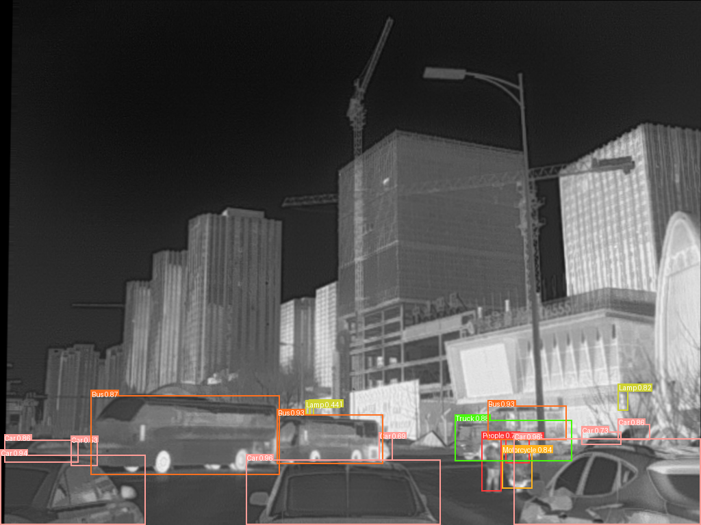
  </a>
  <a href="docs/visible_02059_vis.png">
    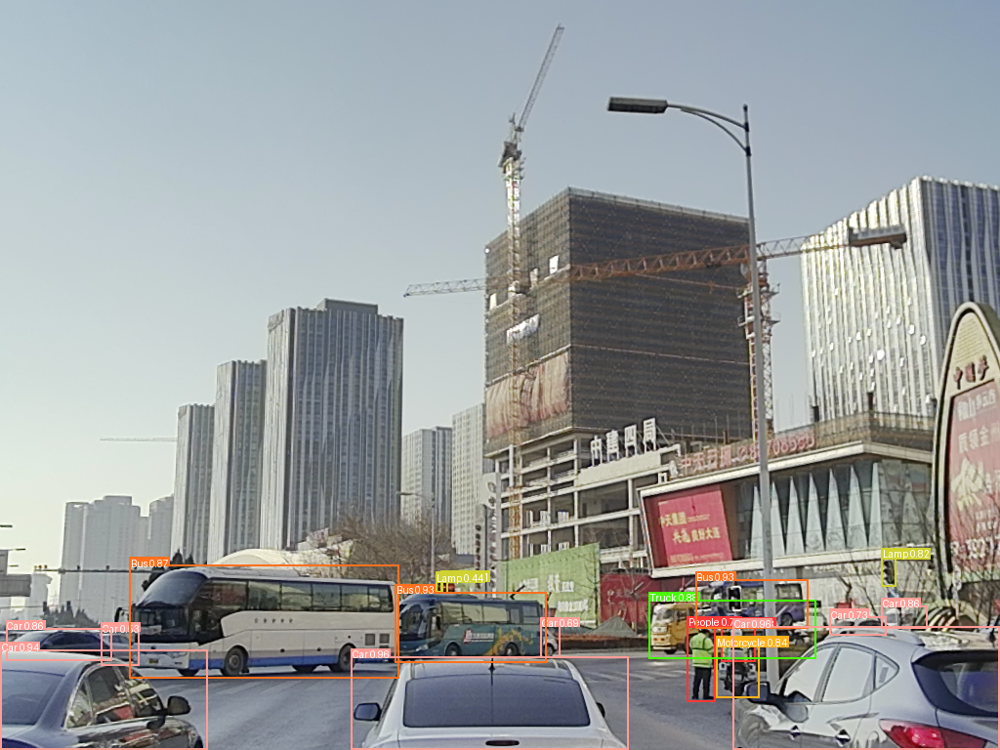
  </a>
</p> 

---

### 📦 Trained Weights

The trained weights of **CFGPNet-m**, **CFGPNet-c**, and **CFGPNet-e** for five datasets: **FLIR**, **M3FD**, **LLVIP**, **VEDAI_1**, and **MFAD** are provided.

| **Dataset** | **CFGPNet-m** | **CFGPNet-c** | **CFGPNet-e** |
|:--:|:--:|:--:|:--:|
| **FLIR** | [Google Drive](https://drive.google.com/drive/folders/1FMTGgb-_xi9qW107q-mwX9t8udTSur69?usp=sharing) | [Google Drive](https://drive.google.com/drive/folders/1TrCpz4MHomOkBfBj-i815ZsDxK6y-4Q1?usp=sharing) | [Google Drive](https://drive.google.com/drive/folders/1uDZC4I9LWFp_K46d6VH5rvjm8BiQcKnZ?usp=sharing) |
| **M3FD** | [Google Drive](https://drive.google.com/drive/folders/1rA1eisUG-AqWT8vnKbHe0iFuwmyDCXyT?usp=sharing) | [Google Drive](https://drive.google.com/drive/folders/1Shg8dxkNS6hcBq0SnDcJMk1ABWG8kRxQ?usp=sharing) | [Google Drive](https://drive.google.com/drive/folders/1V2UV4IQiLTY63SqdooAg4UN8Diw8vrxJ?usp=sharing) |
| **LLVIP** | [Google Drive](https://drive.google.com/drive/folders/1m1rooooz4rMQaqwS0cDDGwc-1uOm0G4a?usp=sharing) | [Google Drive](https://drive.google.com/drive/folders/17P5-hLpvJmy7AujTXNlHcdjp63jdbuaW?usp=sharing) | [Google Drive](https://drive.google.com/drive/folders/1FvtoHW9x-RRDJxjlpZDTX4SYQVL8LmRv?usp=sharing) |
| **VEDAI_1** | [Google Drive](https://drive.google.com/drive/folders/1AY9JXRuOjEVTOWcts-KEdGjppoKCTbtw?usp=sharing) | [Google Drive](https://drive.google.com/drive/folders/1w7pdW0uYm3rKn-tTYGNOixahZOUTDI4l?usp=sharing) | [Google Drive](https://drive.google.com/drive/folders/1LGKyeAmDCP4qCmPLivFApM4soiLFk9Lr?usp=sharing) |
| **MFAD** | [Google Drive](https://drive.google.com/drive/folders/1fl1CKyJO4dLnD4_2dhZ6FHvBF9yv2gNh?usp=sharing) | [Google Drive](https://drive.google.com/drive/folders/1nPm9hHtwty-BoXjkDT_f7WSvb5THe6xN?usp=sharing) | [Google Drive](https://drive.google.com/drive/folders/1FU2LsksTc8jvgGV1MU2uRgH88KPe1MF-?usp=sharing) |

After downloading the weights, place them in the `weights/` directory. For example:

```code
weights/
├── FLIR/
│   ├── CFGPNet-m.pt
│   ├── CFGPNet-c.pt
│   └── CFGPNet-e.pt
├── M3FD/
│       └── ...
├── LLVIP/
│       └── ...
├── VEDAI_1/
│       └── ...
└── MFAD/
        └── ...
```

---

### 🚀 validation & Inference Command 

To run validation, use the following command:

```bash
python val.py --batch-size 10 --conf-thres 0.001 --iou-thres 0.6 --device 0 --data datasets/FLIR.yaml --weights weights/FLIR/CFGPNet-e.pt --name exp12 --exist-ok
```

> **Notes:** To validate the test set, use --task test.

For example, if you run validation with the **CFGPNet-c** model on **split 1** of the **VEDAI** dataset, you should see a log similar to the following: 

<details><summary> <b>Validation log</b> </summary>

```
PASTE YOUR VALIDATION LOG HERE
```

</details>

To run Inference, use the following command:

```bash
python detect.py --conf 0.1 --device 0 --weights weights/FLIR/CFGPNet-e.pt --source data --name CFGPNet-e_detect1 --exist-ok
```

The file names for pair-images on which you are to perform inference must be like this: 

```code
data/
├── infrared_000001.jpg
├── visible_000001.jpg
├── infrared_000002.jpg
├── visible_000002.jpg
└── ...
```

---

### ⚙️ Suitable NMS IoU Thresholds

Use the following NMS IoU thresholds when validating CFGPNet models on each dataset.

| **Dataset** | **FLIR** | **M3FD** | **LLVIP** | **VEDAI** | **MFAD** |
|:--:|:--:|:--:|:--:|:--:|:--:|
| **NMS IoU threshold** | 0.6 | 0.5 | 0.65 | 0.45 | 0.55 |

---

## 🖼️ Visualization

To better illustrate the qualitative performance of CFGPNet, visualization results are provided comparing CFGPNet with other state-of-the-art methods using inference examples from each dataset.

| **Dataset** | **Visualization** |
|:--:|:--:|
| **FLIR** | [Google Drive](https://drive.google.com/file/d/1rIlNZx-612VkGdpcHPZ2X3IMk6j36CSB/view?usp=sharing) |
| **M3FD** | [Google Drive](https://drive.google.com/file/d/1CdiGzazrU6HuMzYj27tqhvehj_xzccVN/view?usp=sharing) |
| **LLVIP** | [Google Drive](https://drive.google.com/file/d/1JxjZmdj47dAQZWa6JSSbe8JE7IBmoP4g/view?usp=sharing) |
| **VEDAI** | [Google Drive](https://drive.google.com/file/d/1FzIE4AJgRnAcF9vXNqVzpR1w4h8jkesN/view?usp=sharing) |
| **MFAD** | [Google Drive](https://drive.google.com/file/d/1zHKN1k5vMVfD-U1ptLw2pB4c8B2OiEag/view?usp=sharing) |

---

## 🙏 Acknowledgements

<details><summary> <b>Expand</b> </summary>

* [https://github.com/WongKinYiu/yolov9](https://github.com/WongKinYiu/yolov9)
* [https://github.com/YOLOonMe/EMA-attention-module](https://github.com/YOLOonMe/EMA-attention-module)
* [https://arxiv.org/abs/2403.01123](https://arxiv.org/abs/2403.01123)
* [https://github.com/andreasveit/densenet-pytorch/](https://github.com/andreasveit/densenet-pytorch/)
* [https://github.com/VainF/pytorch-msssim](https://github.com/VainF/pytorch-msssim)
* [https://github.com/THU-MIG/RepViT](https://github.com/THU-MIG/RepViT)
* [https://github.com/houqb/CoordAttention](https://github.com/houqb/CoordAttention)
* [https://github.com/hujie-frank/SENet](https://github.com/hujie-frank/SENet)
* [https://github.com/Peachypie98/CBAM](https://github.com/Peachypie98/CBAM)
* [https://github.com/zhanghengdev/CFR](https://github.com/zhanghengdev/CFR)
* [https://github.com/JinyuanLiu-CV/TarDAL](https://github.com/JinyuanLiu-CV/TarDAL)
* [https://github.com/bupt-ai-cz/LLVIP](https://github.com/bupt-ai-cz/LLVIP)
* [https://downloads.greyc.fr/vedai/](https://downloads.greyc.fr/vedai/)
* [https://github.com/hukefy/EI2Det](https://github.com/hukefy/EI2Det)

</details>

--- 

## 📑 Citation

If you find this repository useful, please cite our paper:

```bibtex

```

--- 

## 📧 Contact

For questions or discussions, please contact **[nima.h@aut.ac.ir](nima.h@aut.ac.ir)**.
